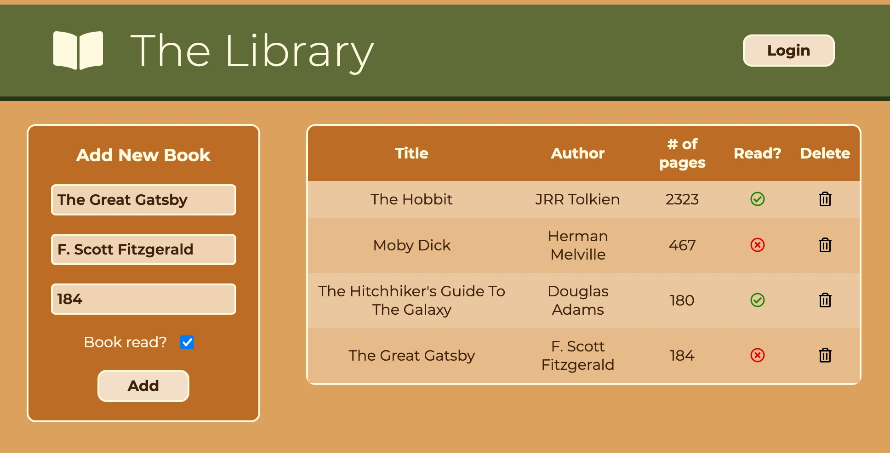

# library
<a href="https://sumedh-inamdar.github.io/library/">link to page</a>

Basic functions
- Add book
- Remove book
- Change read status of book
- Display library in table format
- (future) Login
